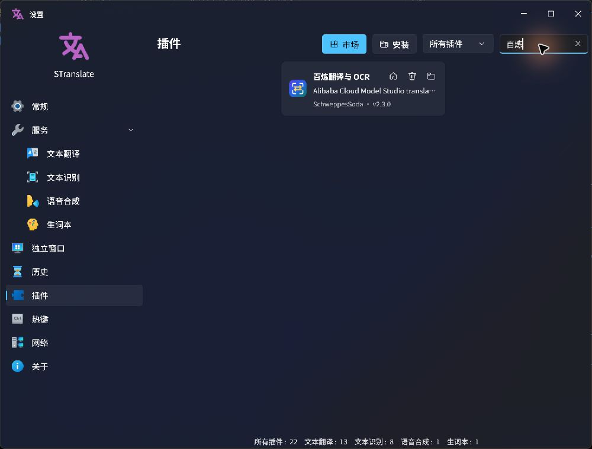

# STranslate 百炼翻译与 OCR

一个 `.spkg` 同时为 [STranslate](https://github.com/STranslate/STranslate) 提供阿里云百炼文本翻译和图片 OCR，支持按量付费、Coding Plan 与 Token Plan。默认使用按量付费和 `qwen3.7-plus`，不会根据 Key 自动猜测或切换线路。

## 安装

从 [Releases](https://github.com/SchweppesSoda/STranslate.Plugin.Bailian/releases) 下载 `STranslate.Plugin.Bailian.spkg`，在 STranslate 的服务管理中安装，然后按需添加翻译或 OCR 服务。

STranslate 按服务实例分别保存配置；翻译与 OCR 可以各自选择模式、模型和 API Key，不需要额外的双凭证开关。

已在 STranslate 2.0.9 完成实际安装验证：



## 计费模式

| 模式 | Base URL | API Key |
|---|---|---|
| 按量付费·中国 | `https://dashscope.aliyuncs.com/compatible-mode/v1` | 中国地域百炼 Key |
| 按量付费·新加坡 | `https://dashscope-intl.aliyuncs.com/compatible-mode/v1` | 新加坡地域百炼 Key |
| Coding Plan | `https://coding.dashscope.aliyuncs.com/v1` | Coding Plan 专用 Key |
| Token Plan | `https://token-plan.cn-beijing.maas.aliyuncs.com/compatible-mode/v1` | Token Plan 专用 Key |

按量模式可填写 Workspace ID 或自定义 HTTPS Base URL；Coding Plan 和 Token Plan 固定使用官方地址。Key、地域和计费模式必须匹配。参见[百炼 Base URL](https://help.aliyun.com/zh/model-studio/base-url)、[Coding Plan](https://help.aliyun.com/zh/model-studio/coding-plan)和[Token Plan](https://help.aliyun.com/zh/model-studio/token-plan-personal-overview)。

## 行为

- 普通模型使用 OpenAI Chat Completions；`qwen-mt-*` 使用百炼机器翻译请求格式。
- 翻译支持 SSE 流式输出、取消、思考参数和推理内容过滤。
- Coding Plan、Token Plan 或普通视觉模型通过视觉对话完成纯文字 OCR。
- 按量模式下选择 `qwen3.5-ocr` 或 `qwen-vl-ocr` 时调用 `advanced_recognition`：优先使用 `location` 四点坐标，仅有 `rotate_rect` 时计算四角；无有效坐标时返回普通文字结果。
- 只有上述两个按量 OCR 模型声明 Bounding Box 能力，因此通用视觉 OCR 不会出现在需要坐标的图片翻译列表中。
- 插件不自动重试、探测模型或切换计费模式。

## 开发

需要 .NET 10 SDK：

```powershell
dotnet restore .\STranslate.Plugin.Bailian\STranslate.Plugin.Bailian.csproj
dotnet build .\STranslate.Plugin.Bailian\STranslate.Plugin.Bailian.csproj -c Release
dotnet run --project .\tests\STranslate.Plugin.Bailian.Tests.csproj -c Release
```

Release 构建由 `STranslate.Plugin` SDK 自动生成 `.artifacts/plugins/STranslate.Plugin.Bailian.spkg`。测试覆盖三种端点、普通与 Qwen-MT 请求、SSE 分片和取消、错误脱敏、纯文字 OCR、两种官方坐标格式、双接口契约及安装包根目录结构。

实现依据：[社区插件开发规范](https://github.com/STranslate/STranslate/blob/main/src/docs/community-plugin-development.md)、[SDK 配置机制](https://github.com/STranslate/STranslate/blob/main/src/docs/plugin-sdk-development.md)和[Qwen-OCR 文档](https://help.aliyun.com/zh/model-studio/qwen-vl-ocr)。

## License

[MIT](LICENSE)
